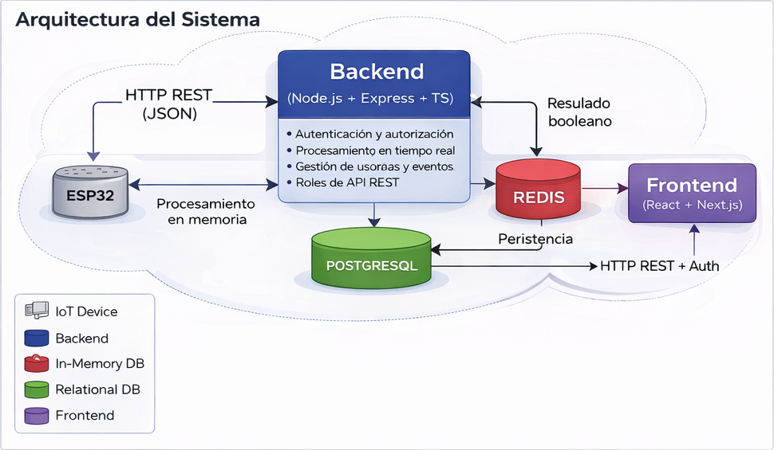
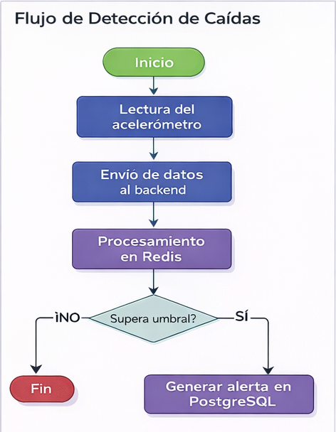

# 1. Arquitectura del Sistema

## 1.1 Visión general

El proyecto **fall-detection-system** implementa un sistema distribuido orientado a la detección automática de caídas en personas mayores, integrando tecnologías IoT, procesamiento en tiempo real y una arquitectura full-stack basada en servicios web.

La arquitectura del sistema se estructura en cuatro capas claramente diferenciadas:

- Captura de datos (dispositivo IoT)
- Procesamiento en tiempo real
- Persistencia de información
- Visualización, gestión y notificación de eventos

Este enfoque permite separar responsabilidades, mejorar la escalabilidad y optimizar el rendimiento del sistema.

---

## 1.2 Componentes del sistema

### 1.2.1 Dispositivo IoT (ESP32)

El sistema incorpora un dispositivo basado en ESP32 al que se conectan:

- Un acelerómetro externo para la medición de variaciones de aceleración
- Un botón de emergencia para activación manual

El dispositivo realiza una lectura continua de los valores del acelerómetro y envía los datos al backend mediante peticiones HTTP en formato JSON.

---

### 1.2.2 Backend (API REST)

El backend constituye el núcleo lógico del sistema y es responsable de:

- Autenticación y autorización de usuarios
- Recepción de datos enviados por el ESP32
- Orquestación del procesamiento en Redis
- Gestión de usuarios, dispositivos y eventos de caída
- Exposición de una API REST protegida por roles

---

### 1.2.3 Procesamiento en Redis

Redis actúa como base de datos en memoria para el procesamiento en tiempo real de los eventos.

Sus funciones principales son:

- Recepción y almacenamiento temporal de las lecturas del acelerómetro
- Aplicación de los cálculos necesarios para evaluar los umbrales de aceleración
- Determinación de la existencia de una caída mediante un valor booleano

Únicamente cuando el resultado del procesamiento indica una caída confirmada, el evento se envía a la base de datos relacional para su almacenamiento persistente.

Este diseño permite desacoplar el procesamiento intensivo del almacenamiento definitivo, optimizando el rendimiento general del sistema.

---

### 1.2.4 Base de datos relacional (PostgreSQL)

La base de datos relacional se utiliza para el almacenamiento persistente y estructurado de:

- Usuarios
- Dispositivos
- Eventos de caída confirmados
- Información asociada a la gestión del sistema

Garantiza integridad, trazabilidad y consistencia de los datos.

---

### 1.2.5 Frontend web

La aplicación web permite la interacción con el sistema a través de una interfaz adaptativa según el rol del usuario.

Entre sus funcionalidades principales se encuentran:

- Visualización de alertas
- Consulta del historial de eventos
- Gestión de usuarios y dispositivos
- Representación gráfica de datos

---

## 1.3 Comunicación entre componentes

La comunicación entre los distintos elementos del sistema se realiza de la siguiente manera:

- **ESP32 → Backend**  
  Envío de lecturas del acelerómetro y eventos mediante HTTP REST en formato JSON.

- **Backend → Redis**  
  Procesamiento en memoria de los datos recibidos y evaluación de los umbrales de detección.

- **Redis → Backend**  
  Retorno del resultado del análisis en forma de valor booleano que determina si se ha producido una caída.

- **Backend → Base de datos relacional (PostgreSQL)**  
  Almacenamiento persistente de los eventos de caída confirmados.

- **Frontend ↔ Backend**  
  Comunicación mediante HTTP REST protegida por autenticación y control de acceso basado en roles.

---

## 1.4 Diagrama de arquitectura

---

## 1.5 Flujo de detección de caídas

El flujo operativo del sistema puede describirse en las siguientes etapas:

1. Lectura continua del acelerómetro en el dispositivo ESP32.
2. Envío de los datos al backend mediante HTTP.
3. Procesamiento en Redis y evaluación de umbrales.
4. Determinación de posible caída.
5. Confirmación del evento.
6. Almacenamiento persistente en PostgreSQL.
7. Visualización de la alerta en el frontend y generación de notificaciones.

