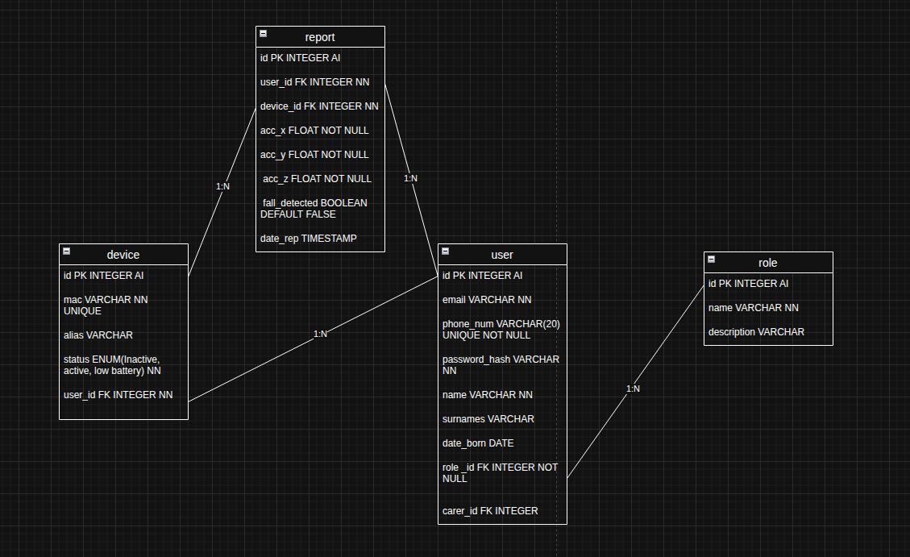

# 2. Modelo de Datos

## 2.1 Introducción

El sistema implementa un modelo de datos híbrido que combina una base de datos en memoria (Redis) para procesamiento en tiempo real y una base de datos relacional (PostgreSQL) para almacenamiento persistente.

Esta arquitectura permite optimizar tanto el rendimiento como la consistencia y trazabilidad de la información almacenada.

---

## 2.2 Redis: procesamiento en tiempo real

Redis se utiliza como motor de procesamiento intermedio debido a su alta velocidad de acceso y capacidad de operación en memoria.

Sus responsabilidades dentro del sistema son:

- Recepción de las lecturas enviadas por el ESP32.
- Almacenamiento temporal de los datos de aceleración.
- Aplicación de los cálculos necesarios para evaluar los umbrales definidos.
- Generación de un valor booleano que determina si se ha producido una caída.

Redis no actúa como sistema de almacenamiento definitivo, sino como componente de procesamiento optimizado para tiempo real.

---

## 2.3 Base de datos relacional (PostgreSQL)

La base de datos relacional se utiliza para el almacenamiento persistente y estructurado de la información crítica del sistema.

Solo cuando Redis confirma una caída (`fallDetected = true`), el backend registra el evento en PostgreSQL.

### 2.3.1 Entidades principales

Las entidades fundamentales del sistema son:

- **Usuario**
  - Identificación
  - Credenciales de acceso
  - Rol asignado

- **Dispositivo**
  - Identificador único
  - Asociación con un usuario
  - Estado del dispositivo

- **Evento de caída**
  - Fecha y hora
  - Valores de aceleración
  - Indicador de caída confirmada
  - Dispositivo asociado

Este diseño garantiza integridad referencial y coherencia entre usuarios, dispositivos y eventos.

---

## 2.4 Diagrama Entidad-Relación

